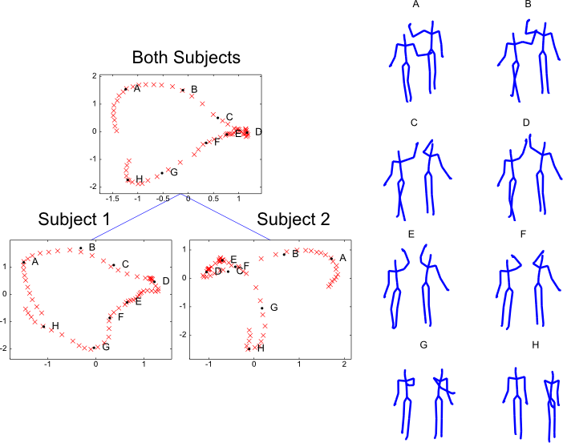
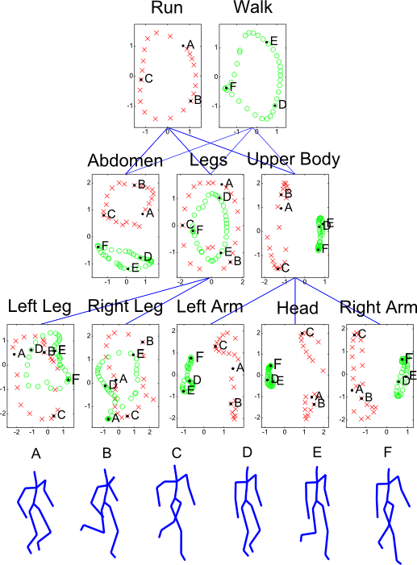

Hierarchical GP-LVM Software
============================

This page describes examples of how to use the hierarchical Gaussian process latent variable model Software (HGPLVM).

The hierarchical GP-LVM allows you to create hierarchies of Gaussian process models. With the toolbox two hierarchy examples are given below.

The HGPLVM software can be downloaded here.

Release Information
-------------------

Current release is 0.1.

As well as downloading the HGPLVM software you need to obtain the toolboxes specified below.

| **Toolbox**                                                                 | **Version** |
|-----------------------------------------------------------------------------|-------------|
| [NETLAB](http://ml.sheffield.ac.uk/~neil/netlab/downloadFiles/vrs3p3)       | 3.3         |
| [PRIOR](http://ml.sheffield.ac.uk/~neil/prior/downloadFiles/vrs0p131)       | 0.131       |
| [OPTIMI](http://ml.sheffield.ac.uk/~neil/optimi/downloadFiles/vrs0p132)     | 0.132       |
| [DATASETS](http://ml.sheffield.ac.uk/~neil/datasets/downloadFiles/vrs0p131) | 0.131       |
| [NDLUTIL](http://ml.sheffield.ac.uk/~neil/ndlutil/downloadFiles/vrs0p157)   | 0.157       |
| [MLTOOLS](http://ml.sheffield.ac.uk/~neil/mltools/downloadFiles/vrs0p126)   | 0.126       |
| [MOCAP](http://ml.sheffield.ac.uk/~neil/mocap/downloadFiles/vrs0p132)       | 0.132       |
| [KERN](http://ml.sheffield.ac.uk/~neil/kern/downloadFiles/vrs0p166)         | 0.166       |
| [GP](http://ml.sheffield.ac.uk/~neil/gp/downloadFiles/vrs0p12)              | 0.12        |
| [FGPLVM](http://ml.sheffield.ac.uk/~neil/fgplvm/downloadFiles/vrs0p151)     | 0.151       |

#### Version 0.001

This is preliminary work released as a placeholder.

### Examples

Two examples of hierarchical models are provided with the code, the first is an example where two interacting subjects are jointly model. Two subjects from the [CMU Mocap data base](http://mocap.cs.cmu.edu) approach each other and 'high five'. The hierarchy models the subjects separately and jointly. It can be run with the command

```matlab
>> demHighFive1 
```

A visualisation of the result, including points that have been propagated through the hierarchy is given below.


 Joint visualisation of the two subjects that 'high five'. The points A, B, C, D, E, F, G and H have been propagated through the hierarchy and are shown on the right. Grey scale visualisations in the latent space have not been shown to keep the smaller plots clear.
A second example involves a subject modelled running and walking. In this case the separate limbs of the subject are split into a hierarchy as shown below.


Hierarchical decomposition of the skeleton. The limbs and abdomen are leaf nodes, behind which we build a hierarchical structure.
This example can be reconstructed with

```matlab
>> demWalkRun1 
```

Results of applying the hierarchical structure to a combined data set of a run and a walk, using two root nodes, one for the run and one for the walk, are shown below.


 Visualisation of a walk and run jointly using hierarchical structures. Again several points have been propagated through the hierarchy.

Page updated on Wed Feb 14 08:50:14 2007


